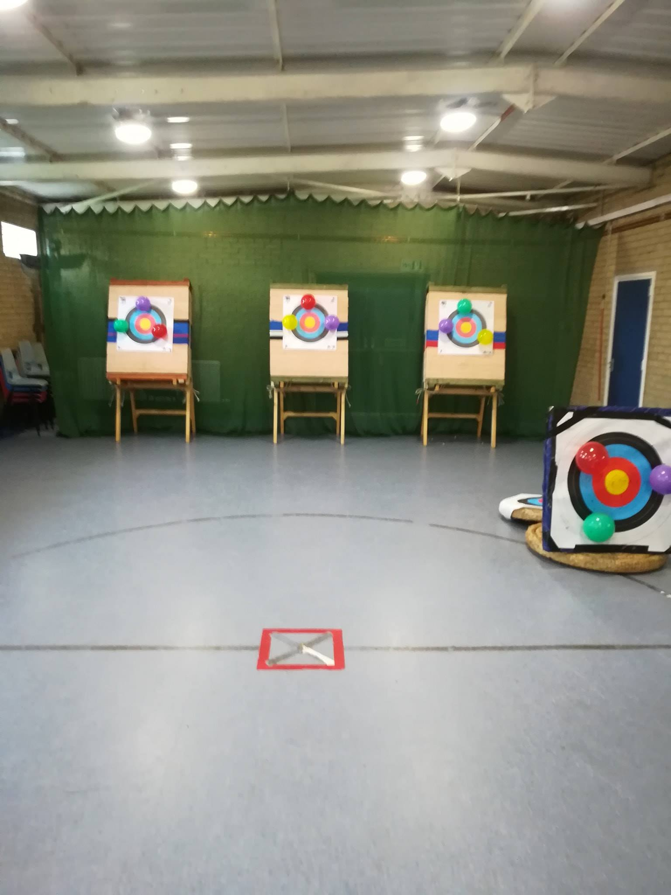

# North East Archers

https://northeastarchers.co.uk/

https://northeastarchers.co.uk/club/beginners

> Senior Courses One Day Intensive · (Age 13+)

North East Archers beginners courses are an intimate affair, with a maximum of nine participants on each course you get undivided attention, sharing, at the most, your coach with two other beginners. This allows the course to progress at your own pace, and allow plenty of opportunity for shooting. Not only that but we'll also give you tips and methods that you can use at home, or work, on the bus, before you have even purchased a bow.

The courses are run as a one day intensive session, allowing rapid and continuous progression, without the need to recap concepts covered in previous weeks, as would be necessary on a traditional course. The course runs from approximately 09:30 through till 16:00, and is split into a series of mini sessions, each lasting for approximately 50 minutes, which is followed by a refreshment and comfort break. We'll even provide tea and coffee making facilities along with juice, although feel free to bring your own drinks and snacks/lunch with you.

## Date

- Sunday 16th Sept 2018

## Price

£65

Senior (18+)
Ages: 18+ (inclusive)
One Day Course
Discounted first year club membership

## Pictures

## Links

- https://www.facebook.com/NorthEastArchers

<iframe src="https://www.facebook.com/plugins/post.php?href=https%3A%2F%2Fwww.facebook.com%2FNorthEastArchers%2Fposts%2Fpfbid0zn9B4ouvH8FUG2gup2fmXXuTAK4SdJuanEfQdK56KtsHsHNY27iMJgJz15be7k8il&show_text=true&width=500" width="500" height="684" style="border:none;overflow:hidden" scrolling="no" frameborder="0" allowfullscreen="true" allow="autoplay; clipboard-write; encrypted-media; picture-in-picture; web-share"></iframe>
