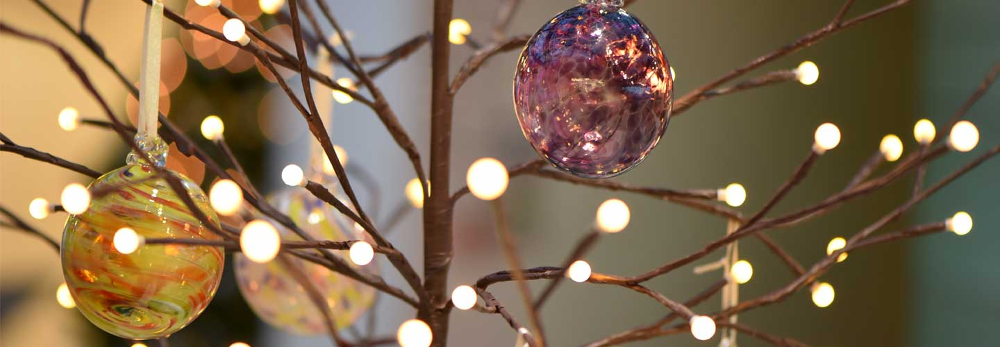
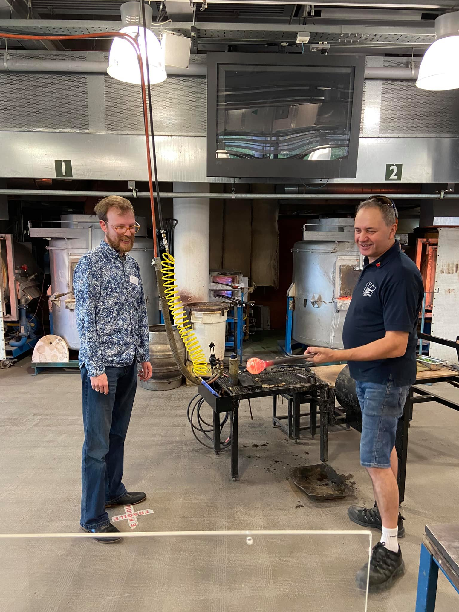
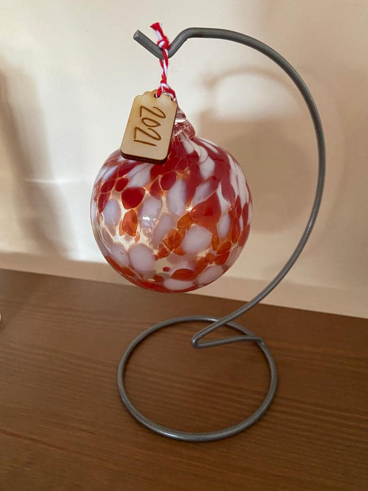

# Make your own Christmas Bauble

## Date

Saturday 13th November

## Price

£30

## Pictures

## Outcome

## About

Delivered every Saturday and Sunday from 6 November – 19December / 1 hour workshops running at 10.00, 11.00, 12.00, 14.00 and 15.00 / Age 12+ (anyone under the age of 18 must be accompanied by an adult for the duration of the session) / £30 / Booking essential.
Please note, to ensure the safety of staff and participants, the actual blowing of the bauble will be done by our glass blowers.

Studio 1

This unique experience offers the opportunity to work with molten glass at over 1100 degrees centigrade! During this workshop, you will create a beautiful glass bauble to hang on your Christmas tree or to give as the perfect handmade gift. Using a variety of coloured glass you can personalise your design before our glass artists blow down the ‘iron’ to make your bauble come to life!

Participants will be permitted to bring **one additional person** into the seating area during their experience.

Before booking please take the time to read the additional information and delivery details below:

## Important Information

- **Collection** – Your bauble will be ready to collect, from the shop counter, 1 week after your workshop.
- **Delivery options** – If you wish to have your bauble delivered to your home, please arrange and pay for this on the day you take part at our Visitor Services Desk. Postage and packing – 1 Bauble = £7 each / 2 Baubles = £14 / 3 -10 baubles = £20 .
- **Refund/Exchanges** – Bookings for Bauble Experiences are non-refundable and dates/times are not transferable. However, you may transfer your experience to a friend or family member if required.
- **Age Restrictions** – This workshop requires no previous experience and is suitable for ages 12+. Please note that anyone under the age of 18 years old must be accompanied by an adult.
- **Suitability** – These workshops are suitable for most people, however, if you have any questions or concerns regarding mobility or safety then please contact the Visitor Services Desk on 0191 568 9700 & discuss whilst booking.
Duration – This workshop lasts 1 hour and includes 7 participants per hour.
Breakages – On rare occasions, your bauble may crack during the cooling process, if this happens we will make a replica/replacement bauble for you – in addition to your bauble which we will also give you if it is not deemed to be unsafe.
- **Dress Code** – Please make sure you are suitably dressed and wearing flat, closed-toe shoes.
- **Water** – It is advisable to bring a small bottle of water with you to stay hydrated
- **COVID** – If you or a member of your party have tested positive for COVID-19, preventing you from attending an event or performance for which you have booked tickets, please contact us up to 24 hours before the event with evidence of a positive test and we will credit you or refund your tickets.  If you have purchased tickets for a performance via an approved agent, please see their booking terms and conditions for the event and contact them directly. If you show symptoms after your visit, please contact the NHS directly on 111 or 119 and follow government guidelines. We will send you a pre-event email ahead of your visit to keep you updated on the latest Covid-19 guidance. Please also check our website, which will be regularly updated with further details, updates and information – all information is correct at the time of publication and is subject to changes to Government guidelines.
All our events are subject to regular risk assessments and while we currently expect to deliver these sessions it may be necessary to cancel for safety reasons if we deem it to be in participants’ best interests. Please refer to our full Make Your Own Baubles terms and conditions

---

## Links

- https://sunderlandculture.org.uk/events/make-your-own-christmas-bauble/
