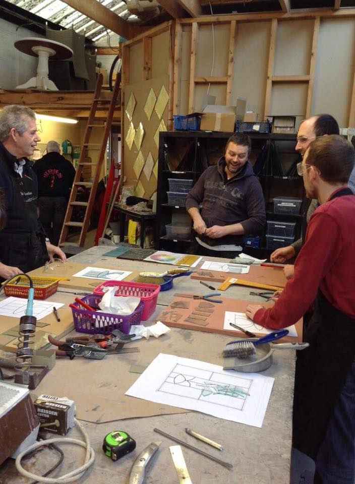
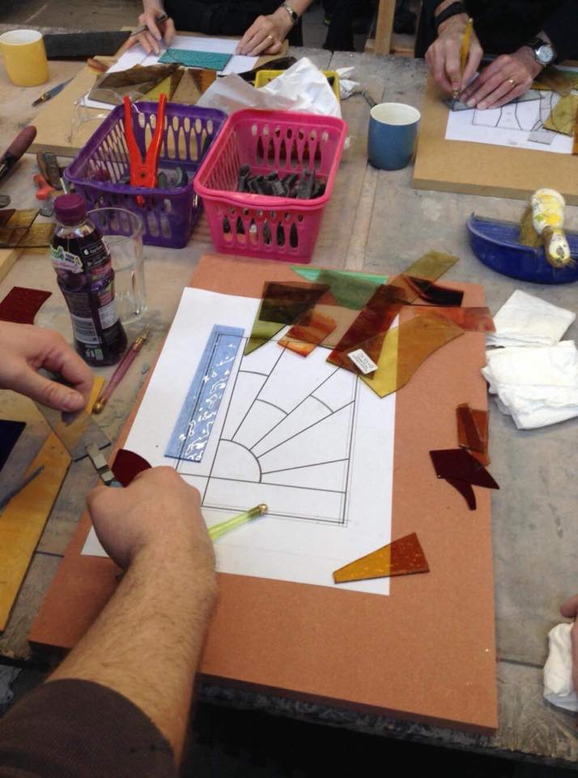
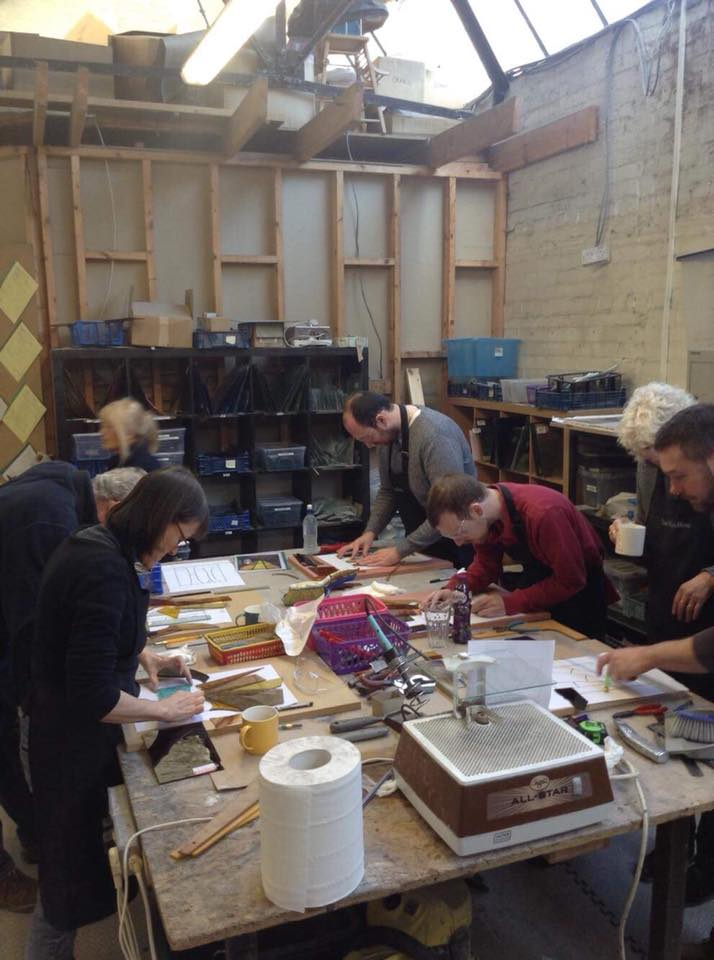
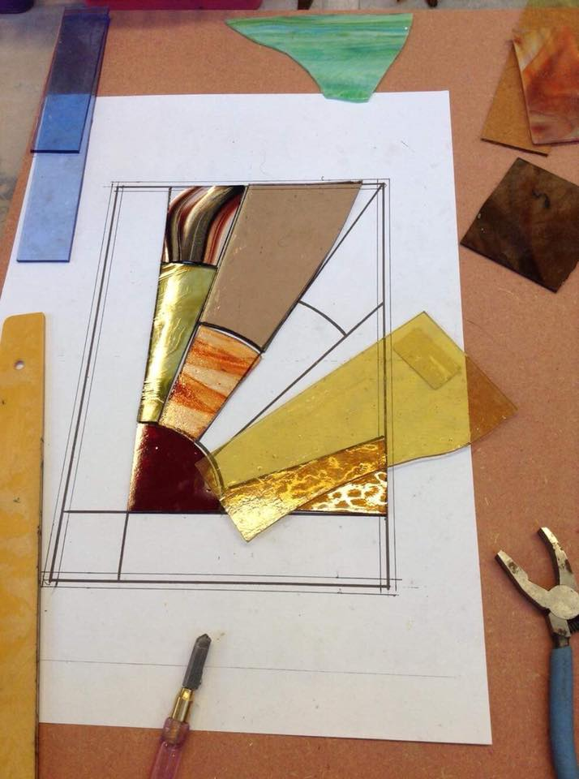
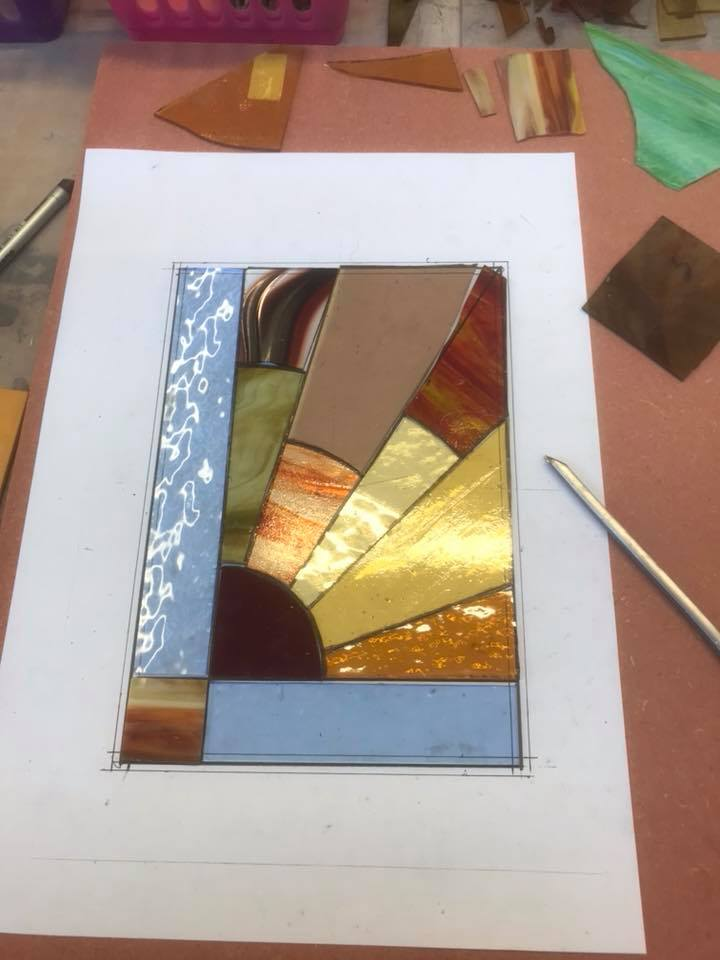
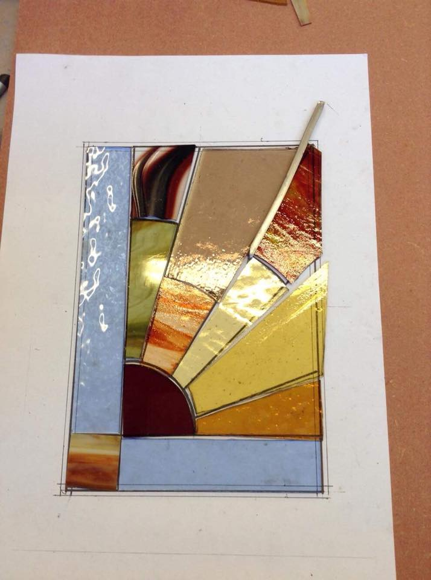
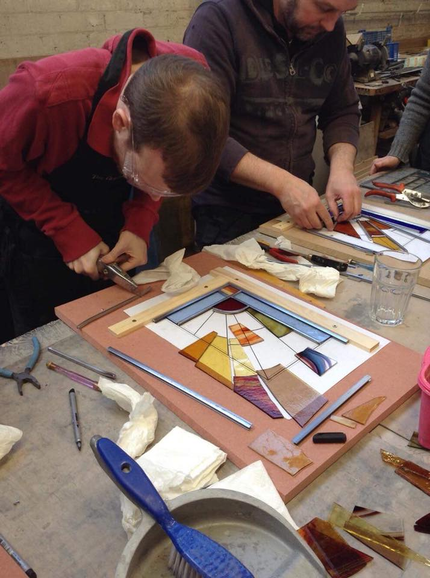
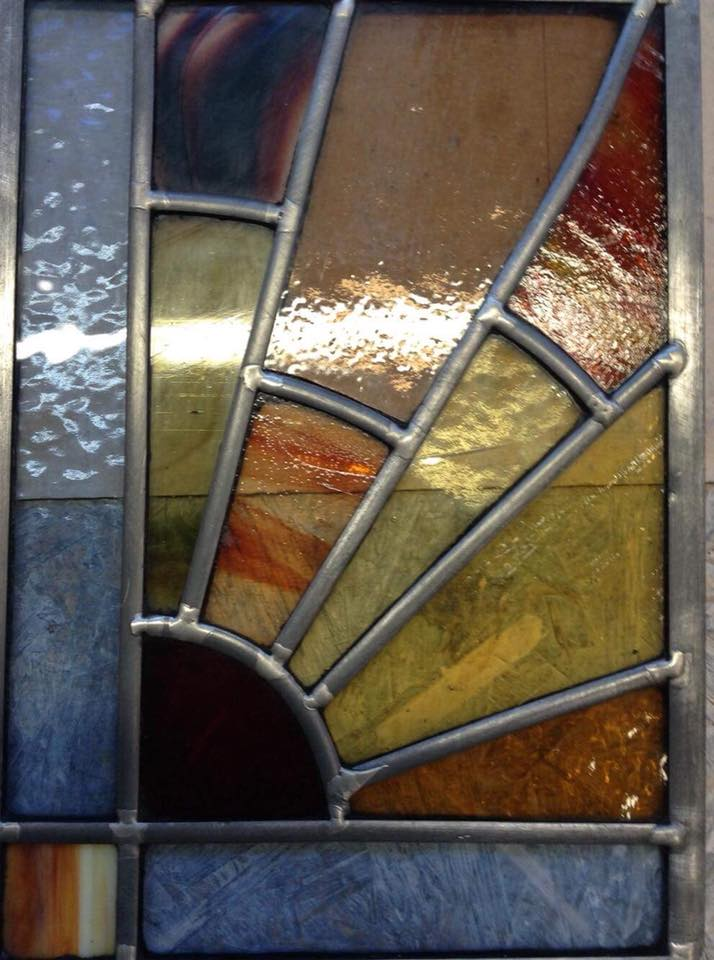
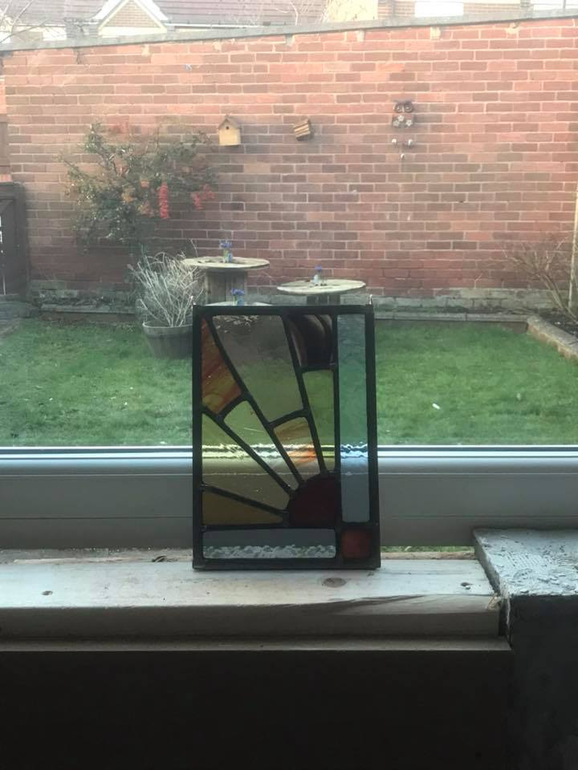

# Beginners Stained Glass

## Date

On: 17 Feb 2018

## About

Learn the basics of Stained Glass in this one day workshop

### Who is this course for?

This one day class is for students who have no previous knowledge or experience working with stained glass, as all practical skills required will be taught as part of this course.

### What does the course cover?

Working with one of our templates you will choose your glass, learn how to cut the glass to size and shape.  Then how to lead your panel and solder it.

### What is included in the fee?

Your fee includes tuition by an experienced stained glass designer, the use of tools and equipment and materials.  Each student will take home a panel that they have created.

There is a maximum of 6 students per class to ensure individual attention.

If you would like to book using a gift certificate please contact the office directly on 0191 2728666.

_Please note, this course involves working with lead, we recommend that pregnant women do not attend._

### What do I need to bring?

- Please wear sturdy and fully enclosed footwear (no open toes or gaping sides) and old clothes that you do not mind getting dirty or damaged.
- Please ensure long hair is tied back.
- There will be a short break for lunch, unfortunately we cannot allow eating within the classroom and have limited space in other areas for breaks which we will make available - you are welcome to bring a packed lunch and there are local cafes available.  
- All drink containers/bottles must have lids.
- Drinks only can be consumed within the classroom and they must be covered with a bottle top or lid.  We are currently unable to provide refreshments but welcome you to bring your own.

### Venue

The GlassHouse, 5b Albion Road, North Shields, NE30 2RJ.

### Course Times

We begin at 9.45am and run until approx’ 4pm, with a short break for lunch.

All our classes are for age 16 and over, unless otherwise specified.

## Price

£78.00 ?

## Pictures

## Outcome

## Links

- https://www.glasshousestudio.co.uk/
- https://www.facebook.com/theglasshouse.glazingandstainedglass.studio/
