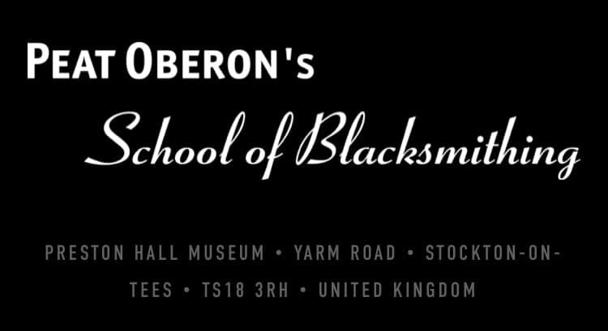

# Peat Oberon's School of Blacksmithing - The Beginners Course

## Date

- Friday 6th May 2022
- Saturday 7th May 2022
- Sunday 8th May 2022

## Price

£390

The cost of the Beginner’s Course is £400 (£390 if paid in full). This includes lunch on each of the three days.

The courses take place from 9.00am to 4.30pm from Friday to Sunday. No previous experience is necessary. Each course can accommodate up to eight people.

This course can also be given as a gift.

## Pictures

## Outcome

## About

Learn six basic techniques of blacksmithing to get you started and make three items to take home with you.

On this course you will learn a series of key blacksmithing techniques which are the foundations for making beautiful ironwork. Over the three days you will develop your skills in these techniques while you make at least three items to take home with you.

Right from the start you'll be making, not just watching. You will experience the thrill of working with hot metal and discover the satisfaction of seeing completed pieces you have made with your own hands.

The techniques you will learn are:

- DRAWING DOWN
- BENDING
- SPLITTING
- PUNCHING
- MAKING SCROLLS
- TWISTING

YOU WILL LEARN ABOUT THE FORGE ENVIRONMENT

HOW TO USE TOOLS EFFICIENTLY AND SAFELY

WHY IT'S IMPORTANT TO USE TOOLS CORRECTLY

YOU WILL MAKE

- A RAT TAIL POKER
- A HANGING BASKET BRACKET
- A RAM’S HEAD TOASTING FORK

YOU WILL ALSO LEARN ABOUT THE HISTORY & BACKGROUND TO THE CRAFT OF BLACKSMITHING

---

## Links

- https://www.school-of-blacksmithing.co.uk/the-courses#beginners-title
