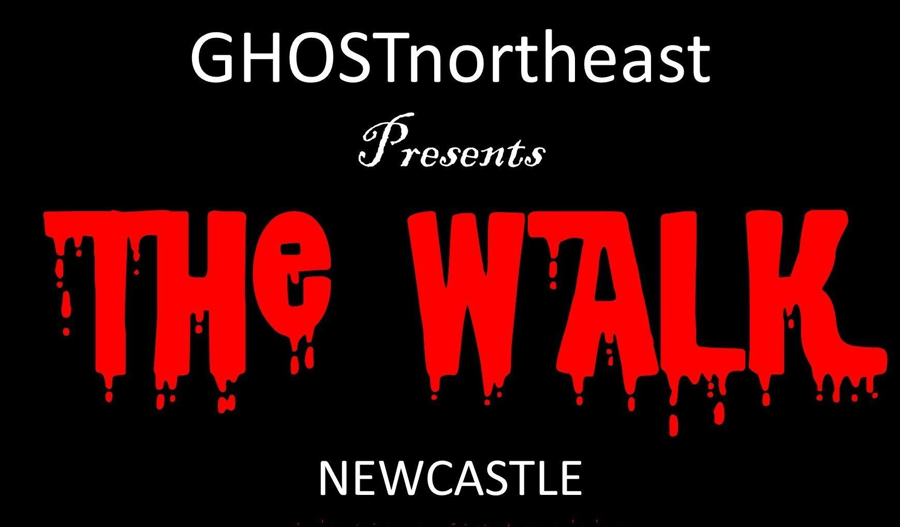

# Ghost

## Date

Sunday 7th November 2021

## Price

£8

## Pictures

*N/A*

## About

Chapter 1 - The Old Town.

WALKS START ON THE STEPS OF THE LIT AND PHIL LIBRARY, 32 WESTGATE ROAD, NE1 1SE

AND FINISH OUTSIDE OF THE CASTLE KEEP, CASTLE GARTH, NE1 1RQ .

FAMILY WALK STARTS 6:45pm - £5pp

ADULT WALK STARTS 8pm - £8pp

JOIN OUR GUIDE AS WE TAKE YOU FOR A TRIP THROUGH TIME AND WE WALK ALONG THE GHOSTLY STREETS,

VISITING SOME OF THE MOST HAUNTED BUILDINGS IN NEWCASTLE.

LISTEN TO TALES OF VAMPIRES, WITCHES AND GHOSTLY APPARITIONS THAT ARE REPORTED TO APPEAR WITHIN

OUR CITY WALLS.

6:45pm - "BRING THE BAIRNS" GHOST WALK.

FAMILY FRIENDLY TALES FROM AROUND THE CITY

(WARNING: TALES OF MILD HORROR AND GORE).

only £5pp

UNDER 18's MUST BE ACCOMPANIED BY AN ADULT

Approx. 60mins

8:00pm - "NOT FOR THE FAINT HEARTED"  ADULT WALK.

A MORE EXTREME LOOK AT OUR HISTORY.

(WARNING: TALES OF EXTREME GORE, SEXUAL CONTENT AND STRONG LANGUAGE).

ONLY £8pp

UNDER 18's MUST BE ACCOMPANIED BY AN ADULT

Approx. 60mins

N.B. ALL WALKS ARE TICKET ONLY AND MUST BE PRE-BOOKED BELOW.

TICKETS WILL EMAILED WITHIN 48 HOURS OF PURCHASE.

PLEASE DRESS APPROPRIATELY AS WE WILL BE THERE RAIN OR SHINE.

ALL BOOKING ARE SUBJECT TO A £1 BOOKING FEE.

WE CAN ARRANGE PRIVATE TOURS, CORPORATE EVENTS, DAYTIME HISTORIC TOURS AND ROUTES FOR THE DISABLED.

WE CAN ALSO ARRANGE FOR A BSL  INTERPRETER TO BE PRESENT FOR YOUR GROUP.

WE ARE DOG FRIENDLY .

CONTACT US AT: info@ghostnortheast.co.uk

## Link

- https://www.ghostnortheast.co.uk/
- https://www.ghostnortheast.co.uk/thewalk